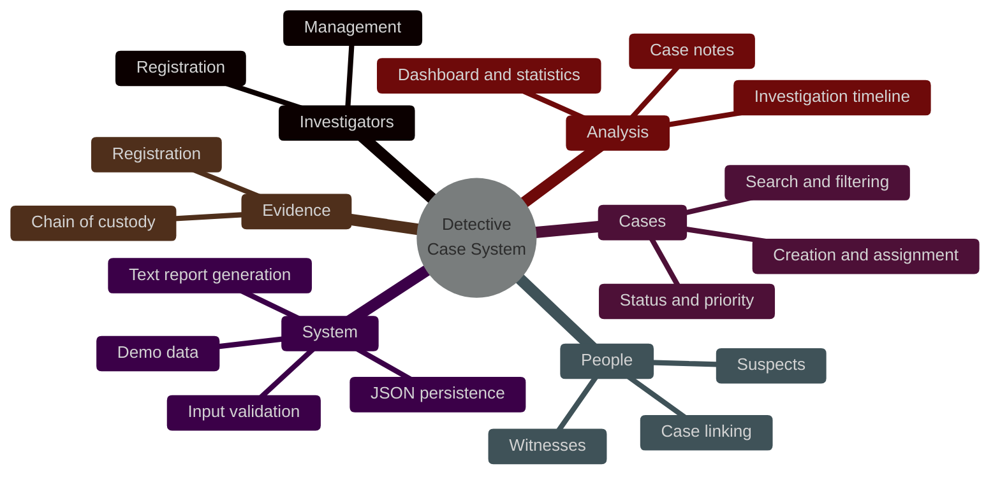
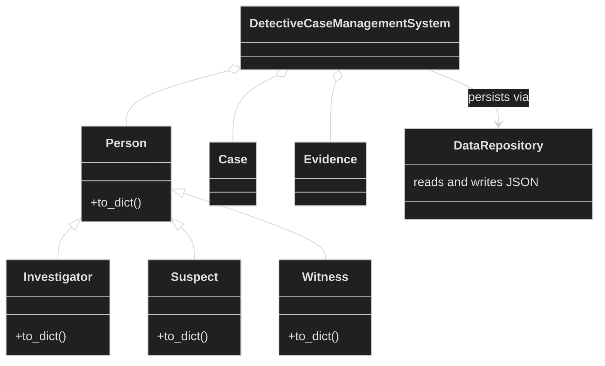
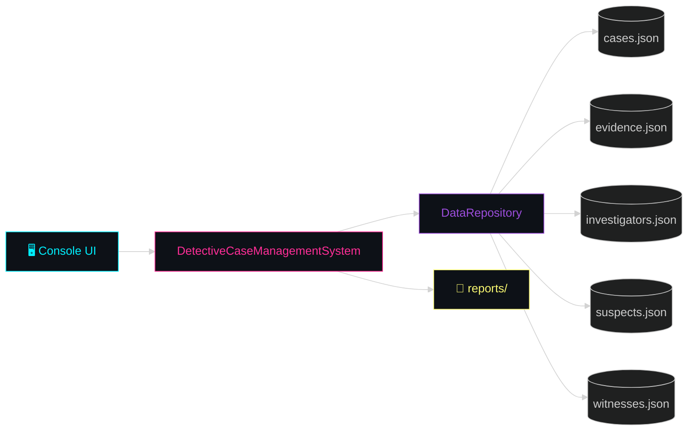
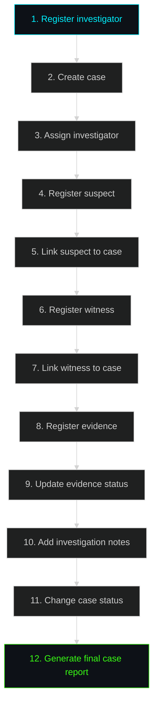

<div align="center">

# 🕵️ Detective Case Management System

### `> investigate. link. solve. report._`

A console-based **Python OOP** project for managing fictional investigation cases,<br>
from the first suspect to the final case report.

<br>


<br>

[✨ Features](#-features) •
[🧠 OOP Concepts](#-oop-concepts-demonstrated) •
[📁 Structure](#-project-structure) •
[🚀 Quick Start](#-quick-start) •
[🧩 Modules](#-main-modules) •
[🗺️ Workflow](#%EF%B8%8F-example-workflow)

</div>

---

## ✨ Features



| | Feature | Description |
|:-:|---|---|
| 👮 | **Investigators** | Register and manage investigators |
| 📂 | **Cases** | Create cases and assign them to investigators |
| 🚦 | **Status & Priority** | Track and update case status and priority |
| 🔍 | **Search & Filter** | Find cases quickly by criteria |
| 🥷 | **Suspects** | Register suspects and link them to cases |
| 👁️ | **Witnesses** | Register witnesses and link them to cases |
| 🧪 | **Evidence** | Full evidence management |
| 🔗 | **Chain of Custody** | Track every handover of each evidence item |
| 📝 | **Notes & Timeline** | Keep case notes and an investigation timeline |
| 📊 | **Dashboard** | Investigation statistics at a glance |
| 💾 | **Auto Persistence** | Data saved automatically as JSON |
| 📄 | **Reports** | Generate text case reports |
| 🎭 | **Demo Data** | Fictional sample records, one menu option away |
| 🛡️ | **Validation** | Input validation and exception handling |
| 📦 | **Zero Dependencies** | No third-party Python packages required |

---

## 🧠 OOP Concepts Demonstrated

| Pillar | Where you'll find it |
|---|---|
| 🔒 **Encapsulation** | Data and behavior are grouped inside classes such as `Case`, `Evidence`, `Person`, and `DetectiveCaseManagementSystem`. |
| 🧬 **Inheritance** | `Investigator`, `Suspect`, and `Witness` inherit common attributes and behavior from `Person`. |
| 🎭 **Polymorphism** | Each specialized person class overrides `to_dict()` to extend the serialized form of the base class. |
| 🧊 **Abstraction** | `DataRepository` hides how JSON files are read and written from the management system. |



---

## 📁 Project Structure

```text
Detective-Case-Management-System/
│
├── 🐍 detective_case_management.py
├── 💾 data/
│   ├── cases.json
│   ├── evidence.json
│   ├── investigators.json
│   ├── suspects.json
│   └── witnesses.json
├── 📄 reports/            # generated case reports appear here
├── 📘 README.md
├── 📋 requirements.txt
└── 🙈 .gitignore
```

---

## 🚀 Quick Start

### Requirements

- 🐍 **Python 3.9** or newer
- 📦 No external packages

### Run it

Open a terminal in the project directory:

```bash
python detective_case_management.py
```

On some systems:

```bash
python3 detective_case_management.py
```

### First run

The application automatically creates the `data` directory and the JSON database files.

> 💡 **Tip:** choose option **`7. Load Demo Data`** from the menu to populate the system with fictional sample records.

---

## 🧩 Main Modules

### 📊 Dashboard

<table>
<tr>
<td valign="top">

**Case metrics**
- Total cases
- Open cases
- Under investigation
- Solved cases
- Closed cases
- Cold cases
- Critical cases

</td>
<td valign="top">

**Records & insights**
- Number of investigators
- Number of suspects
- Number of witnesses
- Number of evidence records
- Resolution rate
- Cases grouped by category

</td>
</tr>
</table>

### 📂 Case Management

- Create cases
- List cases
- Search cases
- Filter cases
- View complete case details
- Assign investigators
- Update case status
- Add investigation notes
- Generate text reports

### 🧪 Evidence Management

- Evidence registration
- Evidence type classification
- Evidence status updates
- Chain-of-custody records
- Case-to-evidence relationships

---

## 💾 Data Storage

The project uses **JSON files as a lightweight local database**. Your data remains available after the application is closed.

> 🔌 No internet connection or database server is required.



---

## 🗺️ Example Workflow



<details>
<summary><b>📋 Same workflow as a checklist</b></summary>

<br>

1. Register an investigator.
2. Create a new case.
3. Assign the investigator.
4. Register a suspect.
5. Link the suspect to the case.
6. Register a witness.
7. Link the witness to the case.
8. Register evidence.
9. Update evidence status.
10. Add investigation notes.
11. Change the case status.
12. Generate the final case report.

</details>

---

## ⚠️ Important Note

> [!NOTE]
> This project is an **educational simulation**. All sample investigation records are **fictional**.

---

<div align="center">

**🕵️ Case closed. Happy investigating.**

<sub>Built with Python and zero dependencies.</sub>

</div>